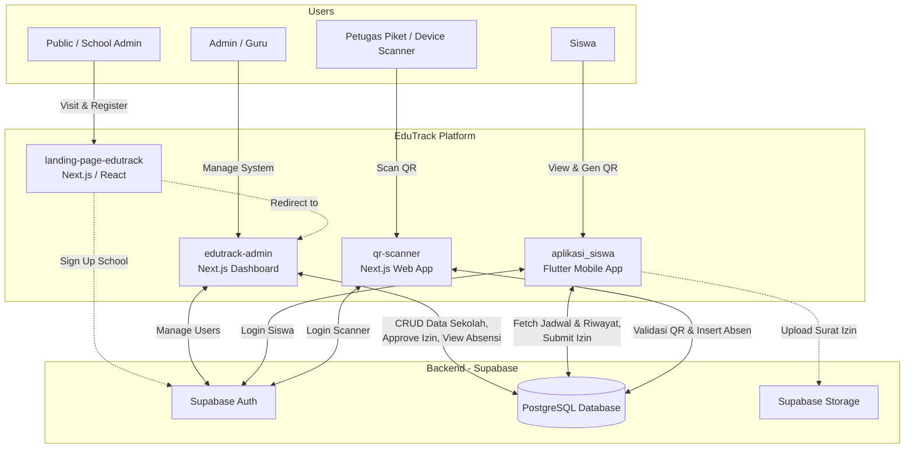
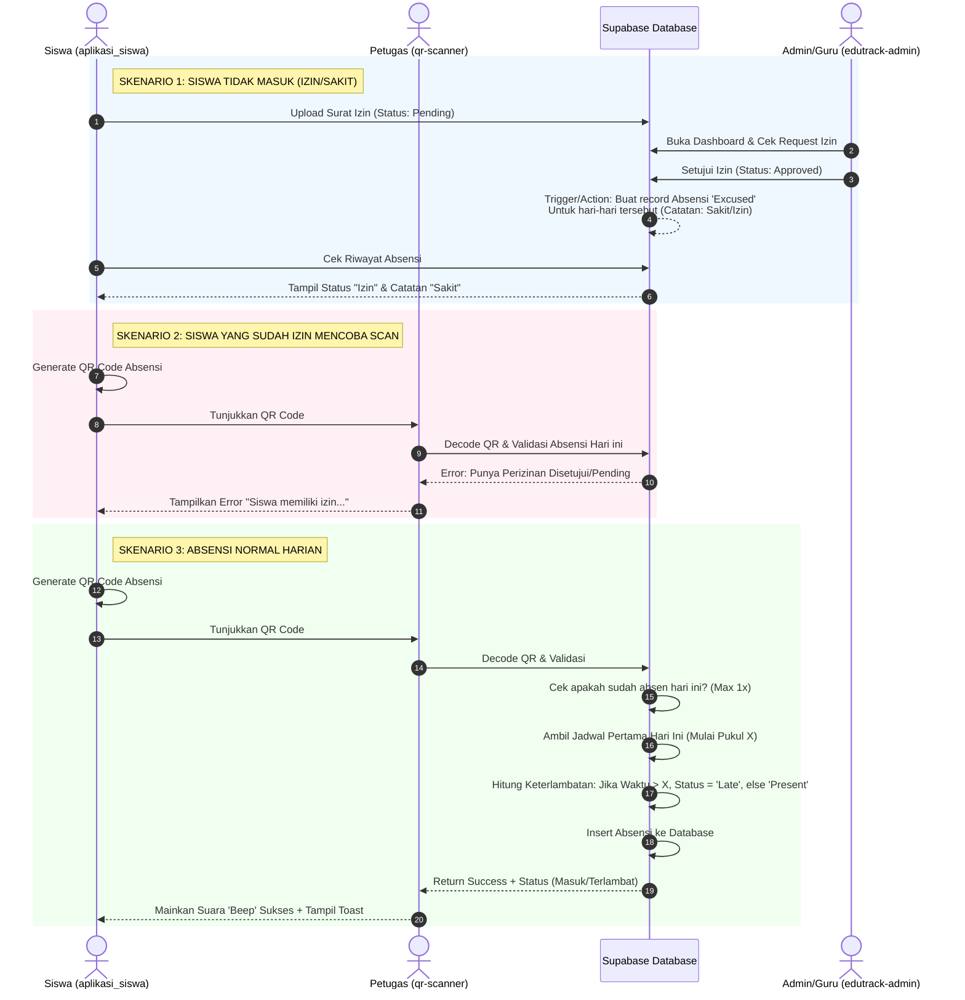
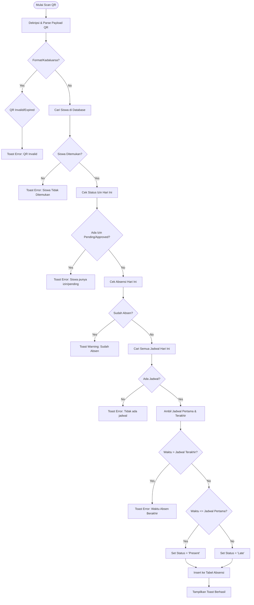
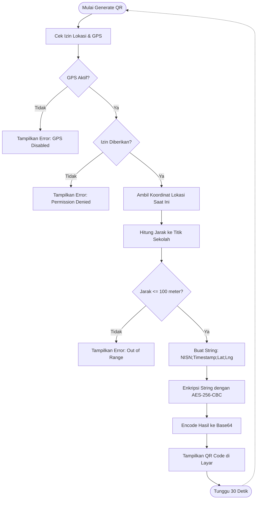
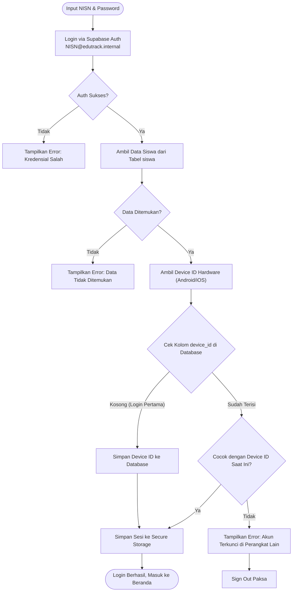
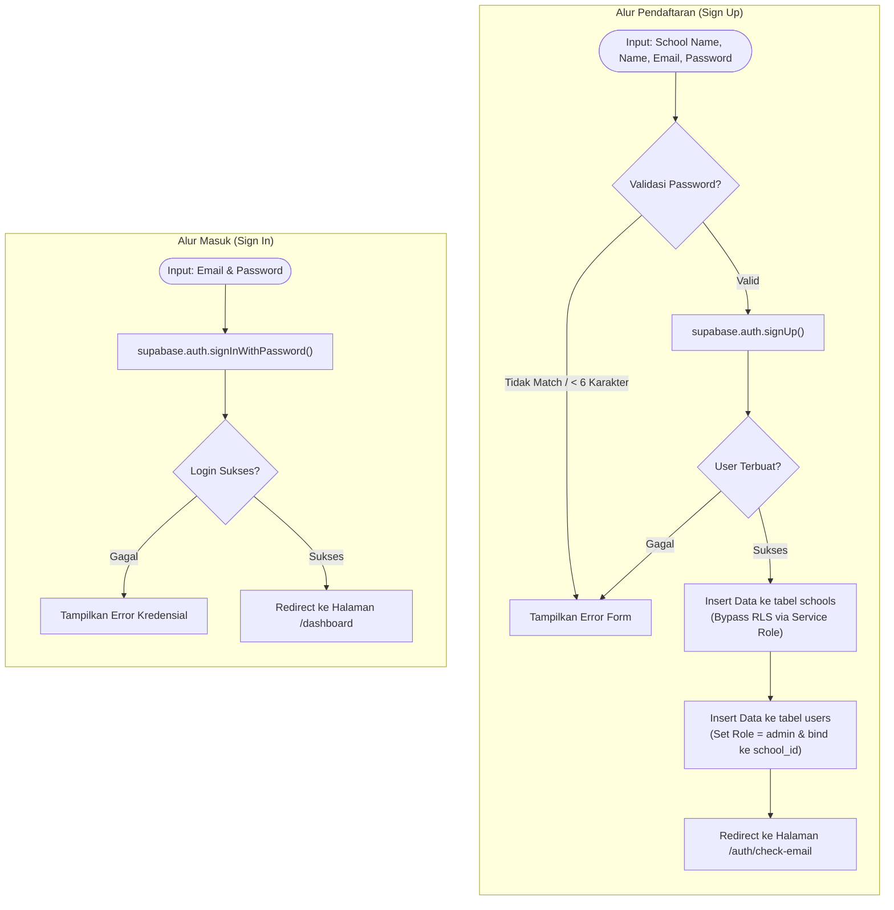
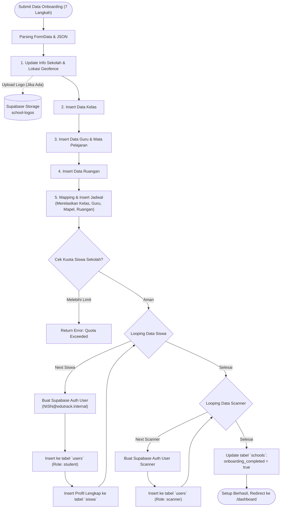
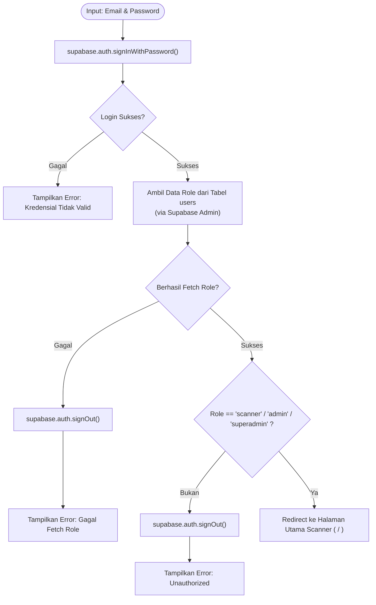

# EduTrack Platform Architecture & Flowcharts

Berikut adalah visualisasi arsitektur dan alur kerja (workflow) dari EduTrack Platform yang terdiri dari 4 aplikasi utama dan Backend Supabase.

## 1. Arsitektur Komponen Keseluruhan (System Architecture)

Diagram ini menunjukkan hubungan antara setiap aplikasi dalam ekosistem EduTrack dengan Supabase sebagai Backend-as-a-Service (BaaS).

---

## 2. Alur Mekanisme Absensi & Perizinan (Attendance Workflow)

Flowchart ini memvisualisasikan mekanisme spesifik absensi harian, pembuatan surat izin, persetujuan izin, dan cara scanner memproses kehadiran (Sesuai dengan logika terbaru yang dibatasi **1 kali sehari** dan **berdasarkan jadwal pertama**).

---

## 3. Alur Kerja Logika Scanner secara Internal (QR Scanner Logic)

Berikut ini adalah logika rinci di dalam `qr-scanner/actions/attendance.ts` saat fungsi scan dipanggil.

---

## 4. Alur Pembuatan QR Code (Generate QR Logic di Aplikasi Siswa)

Flowchart ini memvisualisasikan bagaimana aplikasi siswa memproses, memvalidasi lokasi, dan mengenkripsi data sebelum QR Code ditampilkan di layar. Payload QR akan terus diperbarui otomatis setiap 30 detik untuk keamanan.

---

## 5. Alur Login & Pengikatan Perangkat (Device Binding) di Aplikasi Siswa

Untuk mencegah kecurangan absensi (seperti titip absen), aplikasi siswa menerapkan sistem *Device Binding*. Satu akun NISN hanya dapat login di satu perangkat (HP) yang sama. Flowchart ini menunjukkan proses validasinya.

---

## 6. Alur Registrasi & Login Admin Sekolah (edutrack-admin)

Dashboard admin (`edutrack-admin`) diperuntukkan bagi pihak sekolah untuk mengelola sistem. Registrasi baru akan secara otomatis membuat entitas *tenant* sekolah baru. Flowchart ini memisahkan proses Registrasi dan Login.

---

## 7. Alur Setup Wizard (Onboarding) di Admin Dashboard

Setelah registrasi awal selesai, Admin sekolah akan dihadapkan dengan 7 langkah pengisian data master. Data ini disimpan sekaligus pada akhir *step* untuk mencegah anomali relasi data.

---

## 8. Alur Login Aplikasi QR Scanner (`qr-scanner`)

Aplikasi pemindai QR memiliki mekanisme proteksi _Role-Based Access Control_ (RBAC) pada saat proses login. Aplikasi akan memastikan bahwa hanya user dengan akses sebagai petugas pemindai atau admin yang bisa mengakses halaman _Scanner_.

